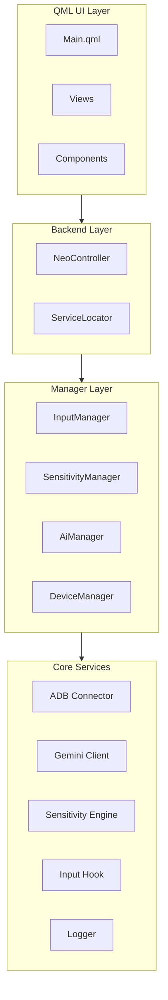
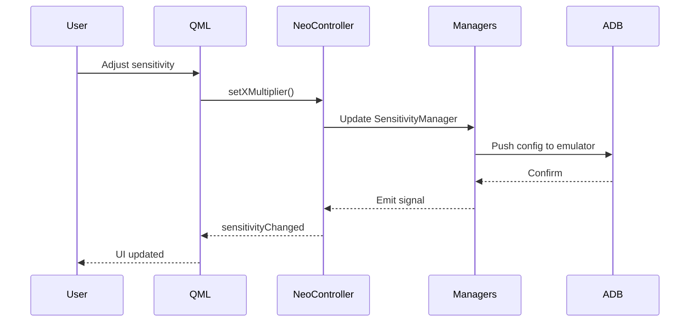

# Neo-Z Architecture

High-level architecture and design documentation for the Neo-Z application.

---

## System Overview

Neo-Z is a Qt 6 application that provides gaming sensitivity optimization and Android emulator control. The architecture follows a layered pattern with clear separation between UI, business logic, and core services.



---

## Component Details

### Backend Layer

| Component | File | Purpose |
|-----------|------|---------|
| **NeoController** | `src/backend/NeoController.h` | Main QML-exposed controller, orchestrates all subsystems |
| **ServiceLocator** | `src/core/ServiceLocator.h` | Dependency injection container for loose coupling |

### Manager Layer

| Manager | Responsibility |
|---------|----------------|
| **InputManager** | Mouse/keyboard input capture and processing |
| **SensitivityManager** | DRCS calculations and curve adjustments |
| **AiManager** | AI recommendation lifecycle and confidence gating |
| **DeviceManager** | Emulator detection and ADB device management |

### Core Services

| Service | Files | Description |
|---------|-------|-------------|
| **ADB** | `src/core/adb/` | AdbConnector, AdbConnection for emulator communication |
| **AI** | `src/core/ai/` | GeminiClient for API calls, AiAdvisor for recommendations |
| **Sensitivity** | `src/core/sensitivity/` | DRCS, VelocityCurve, SensitivityCalculator |
| **Input** | `src/core/input/` | InputHook, WindowsInputReader, LogitechHID |
| **Aim** | `src/core/aim/` | CrosshairDetector for aim state monitoring |
| **Logging** | `src/core/logging/` | Thread-safe Logger with file output |

---

## Data Flow



---

## Technology Stack

| Layer | Technology |
|-------|------------|
| **UI** | Qt 6 QML, Qt Quick Controls 2 |
| **Backend** | C++20 |
| **Build** | CMake 3.16+ |
| **AI** | Google Gemini API (REST) |
| **Device Comm** | ADB (Android Debug Bridge) |
| **Input** | Windows Raw Input API, HID |

---

## Key Design Decisions

1. **Service Locator Pattern** — Enables loose coupling between managers without direct dependencies
2. **Smart Pointers** — `std::unique_ptr` for owned objects, raw pointers only for Qt parent-child
3. **Async Architecture** — Non-blocking ADB operations with signal-based completion
4. **QML/C++ Separation** — Business logic in C++, presentation in QML

---

## Directory Structure

```
src/
├── backend/          # QML-exposed controllers
├── core/
│   ├── adb/          # Android Debug Bridge
│   ├── ai/           # Gemini AI integration
│   ├── aim/          # Crosshair detection
│   ├── config/       # Configuration management
│   ├── input/        # Input handling (mouse/keyboard)
│   ├── ipc/          # Inter-process communication
│   ├── logging/      # Logger service
│   ├── managers/     # Business logic managers
│   ├── perf/         # Performance utilities
│   └── sensitivity/  # DRCS & calibration
├── ui/
│   ├── components/   # Reusable QML components
│   ├── style/        # Theming (Style.qml)
│   └── views/        # Screen views
└── app/              # Application entry point
```
